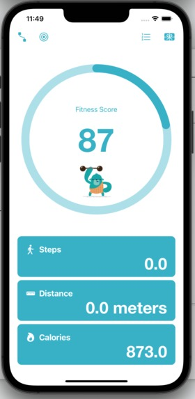
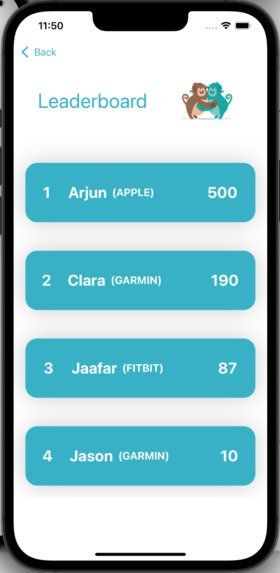
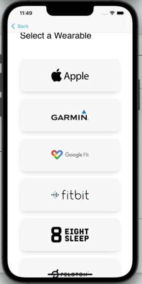
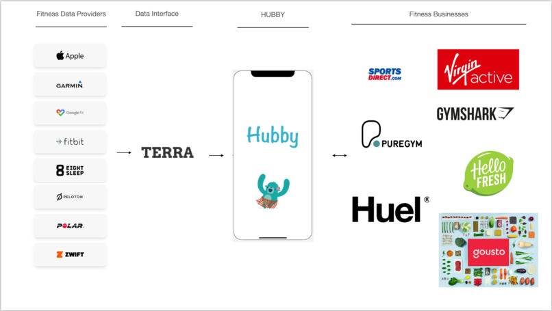

## Summary

You've got a Google Fit and your friend has an Apple Watch. How do you keep up with each another's workouts and activity?

Hubby is the hub for workout buddies. Powered by [Terra](https://tryterra.co), Hubby allows to add any health wearable you have and connect to a platform where you can set fitness score targets, compare with your friends' scores, and signup for vouchers from fitness providers such a Huel or or PureGym when you reach a certain score.

Built with Javascript and Swift

## Tech

- 20 different providers of data
- Connect with two clicks your provider
- Sync on a backend your fitness data
- Labelled data differentiates manual / fake data
- Swift frontend to present fitness score, vouchers, and leaderboard

## Gamification

- Leaderboard with all other connected players
- Vouchers from fitness businesses (both large and growing ones)
- Personal targets to reach specific vouchers

## Business

- Users are our assets so we don’t charge them
- Costs will mainly come from data provenance
- Income will come from partnerships with businesses
- Growing within the fitness promotion and advertisement space